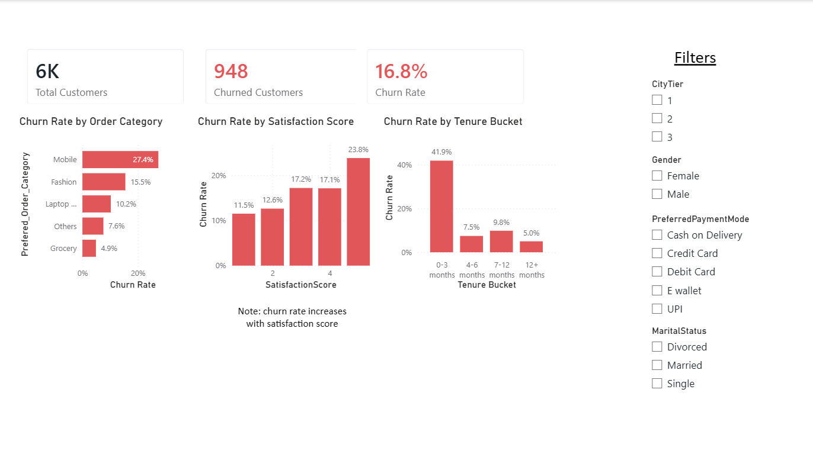
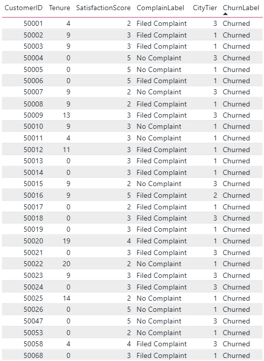

# E-Commerce Customer Churn: Analysis & Prediction

An end-to-end churn analysis project on ~5,600 e-commerce customers, from raw data cleaning through SQL analysis, a predictive model, and an interactive Power BI dashboard.

## Key Insights

- **Complaints are the single strongest behavioral signal**: customers who filed a complaint churn at **31.7%**, nearly 3x the rate of those who didn't (**10.9%**).
- **The first 3 months are the highest-risk window**: churn hits **41.9%** for customers with 0-3 months of tenure, dropping to just **5.0%** for customers past 12 months.
- **Mobile category shoppers churn most**: customers whose preferred order category is Mobile churn at **27.4%**, vs. **4.9%** for Grocery, a 5.5x gap between the highest- and lowest-risk category.
- **Counterintuitive finding**: churn rate actually *increases* with satisfaction score (11.5% at score 1 → 23.8% at score 5). This runs against the "unhappy customers leave" assumption and is worth further investigation, possibly customers rating the app highly right before leaving for external reasons (price, relocation, etc.) rather than dissatisfaction.
- A **Random Forest model predicts churn with 98.3% accuracy and 94.8% F1 score**, with tenure, cashback amount, and complaint history as the top predictive features.

## Dataset

Source: [Kaggle: E-Commerce Customer Churn Analysis and Prediction](https://www.kaggle.com/datasets/ankitverma2010/ecommerce-customer-churn-analysis-and-prediction/data) (Ankit Verma). 5,630 customers, 20 features covering demographics, order behavior, satisfaction, and complaint history.

## Data Cleaning

- **Missing values**: 7 numeric columns (Tenure, WarehouseToHome, HourSpendOnApp, OrderAmountHikeFromlastYear, CouponUsed, OrderCount, DaySinceLastOrder) had ~4-5% nulls each, filled with the column median rather than dropped, to avoid discarding ~300 real customer records.
- **Inconsistent category labels**: found and consolidated duplicate categories that were splitting signal across near-identical labels, including `"CC"` / `"Credit Card"`, `"COD"` / `"Cash on Delivery"`, and `"Mobile"` / `"Mobile Phone"`. This cleanup measurably improved the downstream model: Random Forest recall rose from 88.4% to 91.6% and F1 from 93.3% to 94.8% after the fix.

## Modeling

Two models were trained and compared on a held-out 20% test set:

| Metric | Logistic Regression | Random Forest |
|---|---|---|
| Accuracy | 89.6% | **98.3%** |
| Precision | 77.0% | 98.3% |
| Recall | 54.7% | **91.6%** |
| F1 Score | 64.0% | **94.8%** |

**Top predictive features (Random Forest):** Tenure, CashbackAmount, WarehouseToHome, NumberOfAddress, Complain, DaySinceLastOrder.

Logistic Regression is included as an interpretable baseline; Random Forest is the stronger performer and better suited to a production use case where catching actual churners (recall) matters.

## Dashboard

A two-page interactive Power BI dashboard:

- **Churn Overview**: KPI summary (total customers, churned customers, overall churn rate), churn rate broken out by order category, satisfaction score, and tenure bucket, plus slicers for city tier, gender, payment mode, and marital status.

- **Customer Detail**: row-level table for drilling into individual customer records.


## Project Structure

```
├── data/
│   ├── ecommerce_churn.xlsx           # raw source data
│   ├── churn.db                       # cleaned data, SQLite
│   └── ecommerce_churn_for_powerbi.csv
├── notebooks/
│   ├── load_data.py                   # load, clean, impute, write to SQLite
│   ├── explore_charts.py              # exploratory charts (matplotlib)
│   ├── export_for_powerbi.py          # export cleaned data for Power BI
│   ├── train_model.py                 # logistic regression + random forest
│   └── charts/                        # generated PNG charts
├── sql/
│   ├── analysis_queries.sql           # churn rate by segment, complaint, tenure, etc.
│   └── run_queries.py                 # runs all queries against churn.db, prints results
└── README.md
```

## How to Run

```bash
pip install pandas scikit-learn matplotlib openpyxl

cd notebooks
python load_data.py            # builds data/churn.db from the raw Excel file
python explore_charts.py       # generates exploratory charts
python export_for_powerbi.py   # exports the CSV for Power BI
python train_model.py          # trains and evaluates both models

cd ../sql
python run_queries.py          # runs the SQL analysis queries
```

To view the dashboard, open the `.pbix` file in Power BI Desktop and refresh the data source to point at `data/ecommerce_churn_for_powerbi.csv`.

## Tech Stack

Python (pandas, scikit-learn, matplotlib) · SQLite/SQL · Power BI (DAX)
